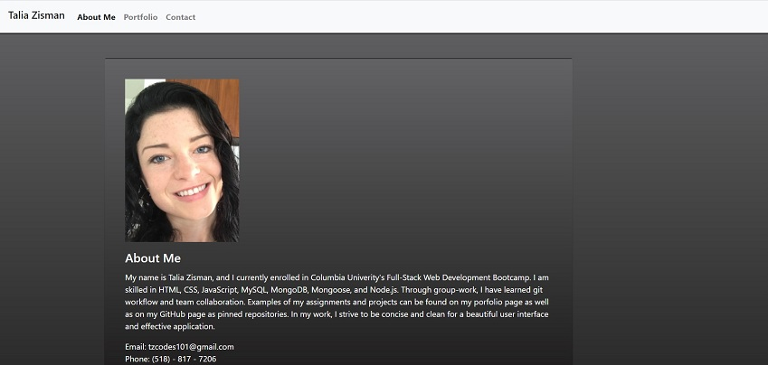

<h1 align=center>React Portfolio</h1>

- Link to GitHub repository: https://github.com/Tzcodes101/reactPortfolio
- Link to deployed site: https://tzcodes101.github.io/reactPortfolio/

## Description
For this project, I re-wrote my previous portfolio using react. My previous portfolio can be found here: 

- Link to GitHub repository: https://github.com/Tzcodes101/updatedPortfolio
- Link to live site: https://tzcodes101.github.io/updatedPortfolio/

This react portfolio has "About Me," "Contact Me," and "My Portfolio" pages. The contact form is not yet active. The layout functions off of Bootstrap 4 and the grid system. The portfolio features three homework assignments I feel went well. The code for these items can be accessed through the portfolio page on the site. My GitHub, LinkedIn, and resume can be accessed on the "About Me" page.

## Table of Contents
- [Description](#Description)
- [Installation](#Installation)
- [Usage](#Usage)
- [License](#License)
- [FutureDevelopment](#FutureDevelopment)
- [Contributors](#Contributors)
- [Testing](#Testing)
- [Questions](#Questions)

## Installation
This project requires no installation.

## Usage
To use this project, a user must navigate to the deployed URL. 

## License

This project is covered by the ISC license.

## Future Development
This project is responsive to various screen sizes, but is not mobile first. A more developed version would be mobile-first and include a humburger menu for navigation upon reaching a certain screen size. The contact form is also still non-functional, and a completed version will have this feature working. 

## Contributors
- Talia Zisman

## Testing
This project can be tested by following the usage instructions.

## Questions
Please e-mail the creator, Talia Zisman, of this readMeGenerator with any questions.
- E-mail: tzcodes101@gmail.com
- GitHub: [tzcodes101](http://github.com/tzcodes101)