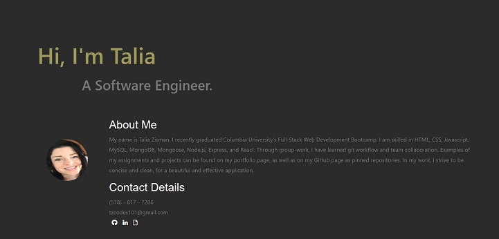

<h1 align=center>React Portfolio</h1>

- Link to GitHub repository: https://github.com/Tzcodes101/reactPortfolio
- Link to deployed site: https://secret-tor-85567.herokuapp.com/about

## Description
For this project, I re-wrote my previous portfolio using react. My previous portfolio can be found here: 

- Link to GitHub repository: https://github.com/Tzcodes101/updatedPortfolio
- Link to live site: https://tzcodes101.github.io/updatedPortfolio/

This react portfolio features "About Me" and "My Portfolio" pages. The portfolio features homework assignments and group projects I feel went well. The code for these items can be accessed through the portfolio section on the site. My GitHub, LinkedIn, and resume can be accessed from the "About Me" section.

## Table of Contents
- [Description](#Description)
- [Installation](#Installation)
- [Usage](#Usage)
- [License](#License)
- [FutureDevelopment](#FutureDevelopment)
- [Contributors](#Contributors)
- [Testing](#Testing)
- [Questions](#Questions)

## Installation
This project requires no installation.

## Usage
To use this project, a user must navigate to the deployed URL. 

## License

This project is covered by the ISC license.

## Future Development
- Scrolldown icon in "About Me" section to navigate user to "Portfolio" section
- Ability to click on image thumbnail for a larger image display
- Funcitonal contact form

## Contributors
- Talia Zisman

## Testing
This project can be tested by following the usage instructions.

## Questions
Please e-mail the creator, Talia Zisman, of this application with any questions.
- E-mail: tzcodes101@gmail.com
- GitHub: [tzcodes101](http://github.com/tzcodes101)